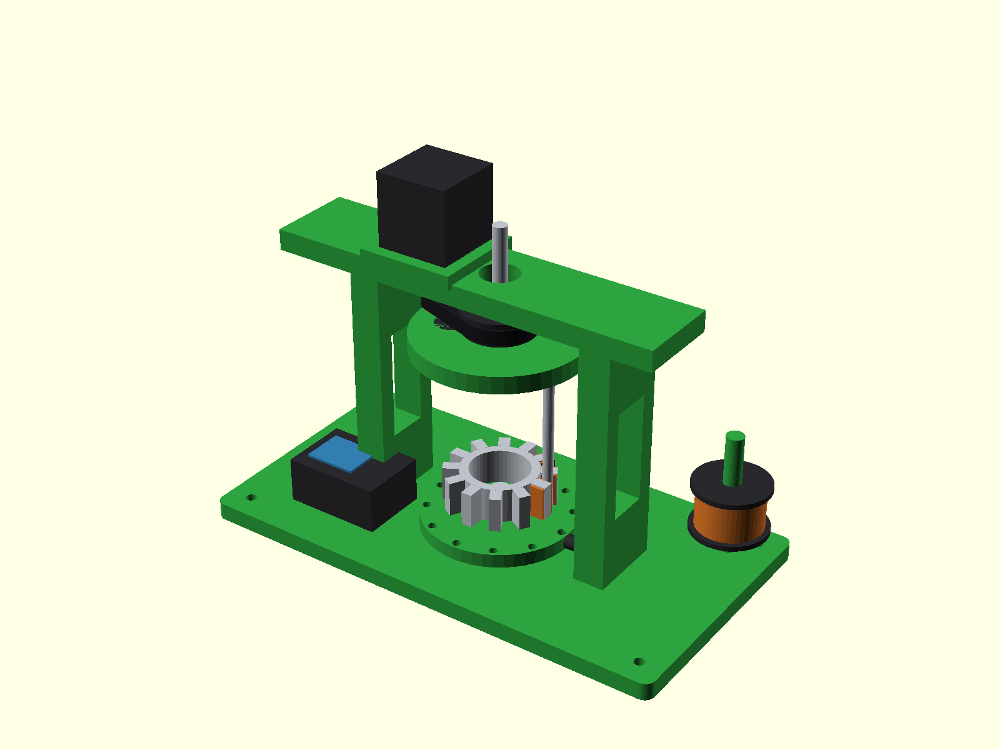
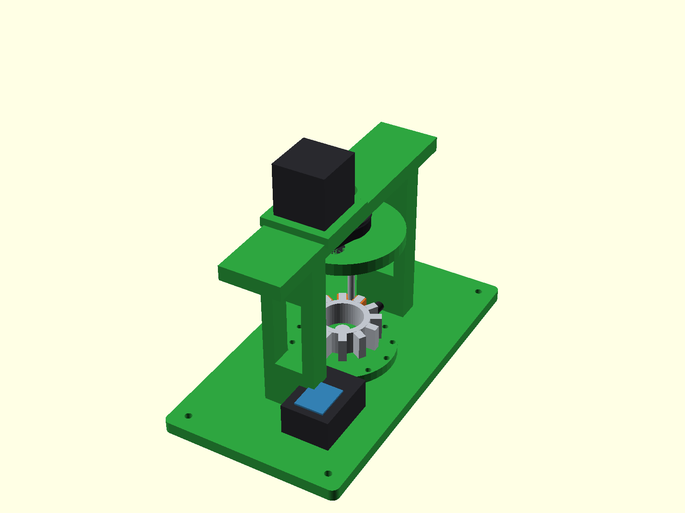

# 3D-Printed BLDC Stator Needle Winder

A parametric concept model (OpenSCAD) of a needle-type winding machine for
brushless motor stators — the kind of machine that lays magnet wire around
each stator tooth, one tooth at a time.



> **Status: concept.** This is CAD only — the machine has not been built, and
> no dimension here is validated against real hardware. Clearances, belt
> tension, and the wire path all need proving on a physical build. Print
> structural parts in PETG.

## How needle winding works

1. The stator sits on the indexing turntable, axis vertical.
2. The needle rotor spins above it. A hollow needle tube orbits at the slot
   radius, feeding magnet wire down through the slots and around one tooth.
3. After the programmed number of turns, the turntable indexes one tooth
   pitch (manual detent in this concept — a second stepper can drive it).
4. A NEMA 17 stepper drives the rotor through a GT2 belt reduction.

## Layout



| Part | Description |
|---|---|
| Base plate | 280 × 150 mm, corner mounting holes, rubber feet |
| Uprights + top bridge | Printed frame, lightening windows |
| Needle rotor | 96 mm disk, offset needle arm, counterweight |
| Needle | Ø6/Ø3.2 mm stainless tube (wire feeds through it) |
| Turntable | 12-detent indexing disk, center post, plunger |
| Drive | NEMA 17 → GT2 belt → rotor pulley |
| Spool holder | Magnet-wire spool with flanges |
| Control box | Concept placeholder for driver electronics |

## Parameters

Everything is parametric at the top of `stator-winder.scad`:

| Parameter | Default | Meaning |
|---|---|---|
| `stator_od` | 62 | Stator outer diameter (tooth tips), mm |
| `stator_yoke` | 44 | Stator yoke diameter (tooth roots), mm |
| `stator_h` | 20 | Stator stack height, mm |
| `teeth` | 12 | Number of stator teeth |
| `orbit_r` | 27 | Needle orbit radius, mm |
| `rotor_d` | 96 | Needle rotor disk diameter, mm |

Change `teeth` and the detent notches, tooth geometry, and winding demo
update together.

## Off-the-shelf BOM (concept)

- 1× NEMA 17 stepper motor
- GT2 belt + 20T / 60T-ish pulleys
- Ø8 mm steel shaft, 608-class bearings for the rotor
- Ø6/Ø3.2 mm stainless tube (needle)
- Magnet wire, M3/M4/M5 hardware, rubber feet
- Stepper driver + Arduino-class controller (control box is a placeholder)

## Rendering

```bash
openscad -o hero.png --imgsize=1600,1200 \
  --camera=10,0,60,60,0,35,220 --autocenter --viewall stator-winder.scad
```

## License

MIT — original design. See [LICENSE](LICENSE).
